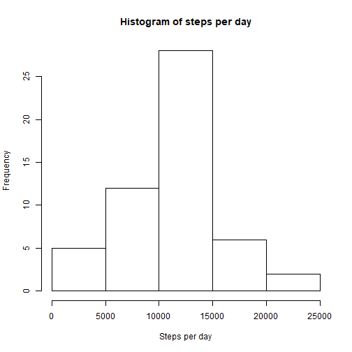
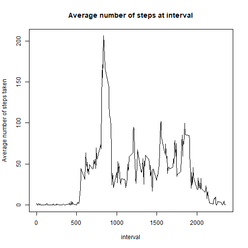

# Reproducible Research: Course project 1
## Loading and preprocessing the data


```r
steps_data<-read.csv("activity.csv")
steps_data$date<-as.Date(steps_data$date,format="%Y-%m-%d")
```

## What is mean total number of steps taken per day?

```r
steps_per_day <- steps_data %>% group_by(date) %>% summarize(sum(steps))
hist(steps_per_day$`sum(steps)`, main = "Histogram of steps per day", xlab = "Steps per day")
```



```r
mean_steps <- mean(steps_per_day$`sum(steps)`, na.rm=TRUE)
mean_steps
```

```
## [1] 10766.19
```

```r
median_steps <- median(steps_per_day$`sum(steps)`, na.rm=TRUE)
median_steps
```

```
## [1] 10765
```

## What is the average daily activity pattern?

```r
avg_interval_steps <- steps_data %>% group_by(interval) %>% summarize(mean(steps, na.rm=TRUE))
plot(avg_interval_steps, type='l', main="Average number of steps at interval", ylab="Average number of steps taken")
```



```r
avg_interval_steps$interval[which.max(avg_interval_steps$`mean(steps, na.rm = TRUE)`)]
```

```
## [1] 835
```
The 835th 5 minute interval is the interval in which on average the most steps are taken.  
## Imputing missing values

```r
sum(!complete.cases(steps_data))
```

```
## [1] 2304
```

```r
steps_data_new <- data.frame(steps_data)
interval_mean <- aggregate(steps_data[,1],by=list(steps_data$interval), mean, na.rm=TRUE)
for(i in 1:nrow(steps_data)){
  if(is.na(steps_data[i,]$steps)){
    this_interval <- steps_data[i,]$interval
    steps_data_new[i,]$steps <- interval_mean[interval_mean$Group.1==this_interval,]$x
  }
}

steps_per_day_na <- steps_data_new %>% group_by(date) %>% summarize(sum(steps))
hist(steps_per_day_na$`sum(steps)`, main = "Histogram of steps per day", xlab = "Steps per day")
```


```r
mean_2 <- mean(steps_per_day_na$`sum(steps)`)
mean_2
```

```
## [1] 10766.19
```

```r
median_2 <- median(steps_per_day_na$`sum(steps)`)
median_2
```

```
## [1] 10766.19
```
- The mean did not change, whereas the median changed slightly, to a non-integer number and equal to the mean.  

## Are there differences in activity patterns between weekdays and weekends?

```r
week_days <- c('Monday', 'Tuesday', 'Wednesday', 'Thursday', 'Friday')
steps_data_new$weekday <- factor((weekdays(steps_data_new$date) %in% week_days), levels=c(FALSE, TRUE), labels=c('weekend','weekday'))
daily_steps <- aggregate(steps_data_new$steps ~ steps_data_new$interval + steps_data_new$weekday, steps_data_new, mean)
xyplot(daily_steps$`steps_data_new$steps` ~ daily_steps$`steps_data_new$interval` | daily_steps$`steps_data_new$weekday`, daily_steps, type = "l", layout = c(1, 2), 
       xlab = "Interval", ylab = "Number of steps")
```


